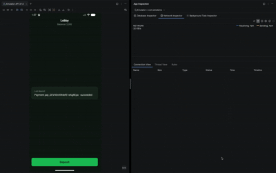

# Deposit demo — server-to-server payments

A React Native demo of a deposit flow built on Hyperswitch, written to be read.
It implements the **Deposit — Server to Server (Payments)** sequence diagram end
to end: create an intent, put the player's amount on it, collect a card or
wallet without ever touching card data, and confirm.

## Preview

The full flow: lobby → amount → payment sheet → CVC → confirmed, back in the
lobby.



Two halves, matching two columns of the diagram:

| Diagram column | Here |
| --- | --- |
| Client / App | the React Native app — `App.tsx`, `src/` |
| Server | `server/index.js` — everything needing the secret API key |
| Payments API / Cards SDK | Hyperswitch, and the `@juspay-tech/*` packages |
| PAM, Fraud screening | stubbed — see [What is not implemented](#what-is-not-implemented) |

---

## Running it

```sh
npm install
cp .env.example .env     # then fill in your keys
npm run server           # the merchant backend, port 5252
npm start                # Metro
npm run android          # or: npm run ios  (cd ios && pod install first)
```

`.env` needs four values from the Hyperswitch dashboard:

| Variable | What it is |
| --- | --- |
| `HYPERSWITCH_BASE_URL` | `https://app.hyperswitch.io/api` for sandbox (`snd_`) keys |
| `HYPERSWITCH_API_KEY` | **Secret** key. Server only — never ships in the app |
| `HYPERSWITCH_PUBLISHABLE_KEY` | `pk_snd_…`, used for session tokens and the SDK |
| `HYPERSWITCH_PROFILE_ID` | `pro_…`, the profile the payment is created against |

The app reaches the server at `src/server/config.ts` — `10.0.2.2:5252` on the
Android emulator, `localhost:5252` on the iOS simulator. For a physical device,
put your machine's LAN IP there.

---

## Where to look

```
server/index.js            the merchant backend: one route per step of the flow
src/
  flow/                    THE SEQUENCE — start here
    useDepositFlow.ts        the whole flow, in order, in one file
    createIntent.ts          step 1  create + method list + session tokens
    updateIntent.ts          step 2  put the amount on the intent
    tokenizeCard.ts          step 3a new card / saved-card CVC → token
    payWithWallet.ts         step 3b wallet sheet → network token
    confirmDeposit.ts        step 4  confirm, and step 5 detection
    types.ts                 CollectOutcome / DepositOutcome
  server/                  talking to our own backend: api.ts, config.ts
  cards/                   the hosted card fields: vault.ts + the two field sets
  wallets/                 Apple Pay, Google Pay, and their native buttons
  ui/                      screens and presentation only — no flow logic
  paymentMethods.ts        shaping the method list: ordering, labels, selection
specs/                     native module specs (Fabric / TurboModules)
```

Every file in `src/flow/` opens with the diagram arrows it implements. If you
read one thing, read `useDepositFlow.ts`.

---

## The flow, arrow by arrow

### Step 0 — The player becomes a customer

```
Server        -> Payments API  : POST /v1/customers
Server        <- Payments API  : customer (id + merchant_reference_id)
```

`ensureCustomer()` in `server/index.js`. Saved cards hang off a customer, so the
player has to be one before an intent can name them. The player's own id goes in
as `merchant_reference_id`, and that is what every later call uses as
`customer_id` — the API's `0a_cus_…` id is never needed, and `/payments` rejects
it with `IR_06`.

The player is written into the two requests that need them — `player_demo_001`
with an email and name; a real integration takes them from whoever is signed in.

Two things about this endpoint are unlike the rest of the API, and both are why
it does not go through `hsFetch`:

- it is under `/v1` on the same host, where the payments calls are not, and
- it authenticates with `Authorization: api-key=…`, not the `api-key` header.

The call runs on every deposit: a player who already exists answers `IR_12`,
which this treats as success. Any other failure is logged and the flow
continues, since the payment names the player by id either way.

### Step 1 — Player reaches the lobby

```
Player        -> Client        : reaches lobby
Client        -> App           : init
App           -> Server        : start deposit
Server        -> Payments API  : /payments (amount 0)
Server        <- Payments API  : payment_method_list + session_tokens
                                 + sdk_authorization
App           <- Server        : data to render
```

| | |
| --- | --- |
| App | `src/flow/createIntent.ts` · called from `useDepositFlow.ts:74` |
| Server | `server/index.js:215` — `GET /api/create-payment` |
| Screen | `src/ui/screens/LobbyScreen.tsx` |

Nothing is created until the player asks: the app makes **no network call on
launch**, and the lobby's Deposit button is what creates the intent.

The server creates the intent with `amount: 0` — no amount has been chosen yet
— and returns what came back:

```jsonc
{
  "payment_id": "pay_…", "client_secret": "…", "publishable_key": "pk_snd_…",
  "payment_method_list": {
    "payment_methods_enabled":  [ /* card:credit, card:debit, wallets… */ ],
    "customer_payment_methods": [ /* the player's saved cards */ ]
  },
  "sdk_authorization": "…",            // the Cards SDK's authorization
  "session_tokens": {
    "session_token":  [ /* one per wallet; empty if none are enabled */ ],
    "vault_details": { "vault_type": "hyperswitch",
                       "vault_data": { "sdk_authorization": "…" } }
  }
}
```

> **One call, not three.** Create is sent with `X-Integration-Type: server`,
> which returns the method list, the wallet session tokens and
> `sdk_authorization` inline. Without that header a server has to follow up with
> `GET /payments/{id}/client` and `POST /payments/session_tokens` itself.
>
> The player is `player_demo_001`, written directly into the customers call and
> the payment. Note that `customer_id` on a payment is the player's own id, not
> the API's `0a_cus_…` id — that format is rejected here with `IR_06`.

Saved methods are ordered most-recently-used first (`sortedSavedMethods` in
`src/paymentMethods.ts`), and the top one leads on both screens. If that top
method is a wallet, its button replaces the Deposit button on the deposit
screen.

### Step 2 — Player enters the amount

```
Player        -> App           : adds deposit amount
App           -> Server        : update amount
Server        -> Payments API  : update payment intent
Server        <- Payments API  : updated session tokens + sdk_authorization
App           <- Server        : refreshed data
```

| | |
| --- | --- |
| App | `src/flow/updateIntent.ts` · `useDepositFlow.ts:104` |
| Server | `server/index.js:265` — `POST /api/update-payment` |
| Screen | `src/ui/screens/DepositScreen.tsx` |

The amount goes in **minor units** (£10.50 → `1050`). The update runs at the two
moments just before the player can pick an instrument: opening the payment sheet
(`useDepositFlow.ts:119`), and pressing Deposit or a wallet button on the deposit
screen (`useDepositFlow.ts:191`).

Why then and not at confirm: a wallet sheet quotes a price baked into its
session token, and the vault session is minted against this intent. Collect
against a stale amount and the player authorises one number while another is
charged.

### Step 3 — Player picks how to pay

Three branches, all ending the same way: something that is **not card data** is
handed to the server.

**3a · New card** — fields mounted under the Card row of the sheet
(`src/cards/NewCardFields.tsx`), inside a session configured from
`vault_details` (`src/cards/vault.ts`). The PAN, expiry and CVC never leave the
SDK's secure inputs; only the token comes back.

**3b · Saved card** — the same `tokenize()` call with *only* the CVC field
mounted and the stored card's `payment_token` named in its options, so it
refreshes that card's CVC instead of collecting a new card
(`src/cards/SavedCardCvcField.tsx`). A CVC field with `savedCard` must be the
only field in its form. Cards with `requires_cvv: false` skip the vault entirely.

**3c · Wallets** — the session token from step 1 drives the native sheet; the app
does not build the request (`src/flow/payWithWallet.ts`). `walletAvailability`
(`payWithWallet.ts:42`) decides whether the buttons are usable: a wallet needs
both a session token *and* a device that can pay.

### Step 4 — Confirm

```
App           -> Server        : token + amount
Server        -> PAM           : authorize          (stubbed)
Server        -> Fraud screening : screen           (stubbed)
Server        -> Payments API  : /payments/confirm
Server        <- Payments API  : next action
```

| | |
| --- | --- |
| App | `src/flow/confirmDeposit.ts` · `useDepositFlow.ts:141` |
| Server | `server/index.js:306` — `POST /api/confirm-payment` |

The body differs by card path, because the vault token means different things.

A **new card** — the token *is* the instrument:

```jsonc
{
  "payment_id": "pay_…",
  "payment_method": "card",
  "payment_method_type": "debit",
  "payment_token": "token_…"                // the vault's token
}
```

A **saved card** — the instrument is already in the locker, so the token carries
only the re-collected CVC:

```jsonc
{
  "payment_id": "pay_…",
  "payment_method": "card",
  "payment_method_type": "debit",
  "payment_token": "token_…",                // the stored card
  "payment_method_data": {
    "card_token": { "card_cvc_token": "…" }  // the vault's token
  }
}
```

Confirm needs the secret key, so it happens on the server, never in the app. The
authorize and fraud calls sit either side of it at `server/index.js:159` and
`server/index.js:169`.

### Step 5 — Next action, and settling

**Only partly implemented.** `confirmDeposit.ts:66` detects a `next_action` on
the confirm response and reports the payment as unfinished rather than claiming
success — but nothing presents the 3DS challenge, and no webhook is received.
`GET /api/payments/:id` (`server/index.js:353`) shows where the status sync
belongs; the app does not call it yet.

However it ends, the player returns to the lobby, which shows the result.

---

## What is not implemented

Each of these is a real arrow in the diagram, stubbed at the point it would be
called so the shape of the flow stays honest.

| Diagram step | Where | What is missing |
| --- | --- | --- |
| Player info + approved limits | — | The lobby balance is the constant `BALANCE` in `src/ui/money.ts`; "Manage Deposit Limits" is inert |
| PAM authorize | `server/index.js:159` | Always approves |
| Fraud screening | `server/index.js:169` | Always approves |
| BIN eligibility | — | The diagram checks the BIN after card entry; not called here |
| Next action (3DS / redirect / QR) | `confirmDeposit.ts:66` | Detected and reported, never presented |
| Status webhook + sync | `server/index.js:183` | Route exists, nothing calls it, no webhook endpoint |
| Manual capture | `server/index.js:193` | Route exists; payments capture automatically |

One more thing not to copy: the amount is displayed in GBP while the intent is
created in USD, because the design is a GBP screen and the sandbox profile is
USD.

---

## Notes for integrators

- **The secret key never reaches the app.** Create, update and confirm all run
  on the server. The app holds only the publishable key and short-lived tokens.
- **The app never sees card data.** There is no card state to read, validate or
  log — the fields are the SDK's, and only tokens cross back.
- **`tokenize()` never throws.** Every outcome, validation failures included, is
  a result with a `code` to branch on and a `message` safe to show. Both
  collection paths funnel into one `CollectOutcome` type.
- **Wallets need a connector.** If no wallet is enabled on the profile,
  `session_token` comes back empty and the wallet buttons simply do not appear.
